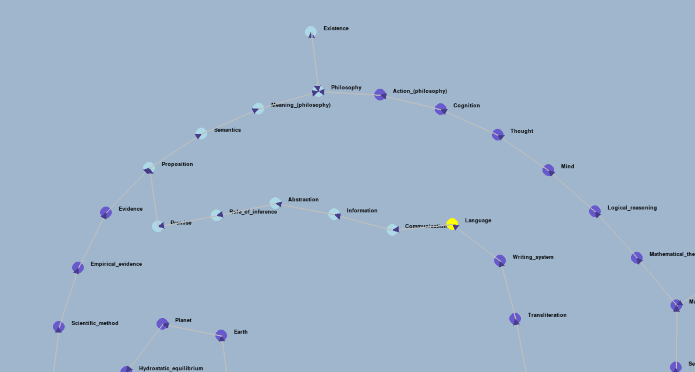

# what is this
a bot to scrape and badly graph wikipedia

this is an educational project only

# what does it need
- selenium  (scrape wikipedia)
- pygame    (display network)
- pymunk    (spring physics)

# images:

